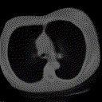
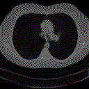
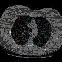
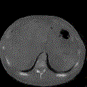
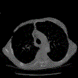

# Interpreting Latent Spaces of Generative Models for Medical Images using Unsupervised Methods
* Data: LIDC [1]
* Both a DCGAN and a Res-Net based CNN-VAE are implemented
* Model agnostic unsuperivesided exploration of the latent space of a generative model [2]

# How To Run
* Download the Data from https://www.cancerimagingarchive.net
* Using the resulting folder structure run [preprocessing](preprocess.py)
* Train [GAN](Training/TrainGAN.py) and/or [VAE](Training/TrainVAE.py)
* Train [Direction Model](Training/TrainDirections.py) on desired generator
* [Evaluate Directions](EvalDirections.py)

# Results
* We see non-trivial image transformations on medical images.
* Many such directions are provided in [Animations](Animations)
* Some examples are the following:
Here are some examples of generated images manipulation by moving along discovered directions:

_VAE - z-Position_

_VAE - y-Position_

_DCGAN - Breast Size_

_DCGAN - Rotation_

_DCGAN - Thickness_

# Credits
The VAE implementation is based on https://github.com/LukeDitria/CNN-VAE  
The Latent Direction Discovery is based on https://github.com/anvoynov/GANLatentDiscovery

[1] Armato III, S. G., McLennan, G., Bidaut, L., McNitt-Gray, M. F., Meyer, C. R., Reeves, A. P., Zhao, B., Aberle, D. R., Henschke, C. I., Hoffman, E. A., Kazerooni, E. A., MacMahon, H., Van Beek, E. J. R., Yankelevitz, D., Biancardi, A. M., Bland, P. H., Brown, M. S., Engelmann, R. M., Laderach, G. E., Max, D., Pais, R. C. , Qing, D. P. Y. , Roberts, R. Y., Smith, A. R., Starkey, A., Batra, P., Caligiuri, P., Farooqi, A., Gladish, G. W., Jude, C. M., Munden, R. F., Petkovska, I., Quint, L. E., Schwartz, L. H., Sundaram, B., Dodd, L. E., Fenimore, C., Gur, D., Petrick, N., Freymann, J., Kirby, J., Hughes, B., Casteele, A. V., Gupte, S., Sallam, M., Heath, M. D., Kuhn, M. H., Dharaiya, E., Burns, R., Fryd, D. S., Salganicoff, M., Anand, V., Shreter, U., Vastagh, S., Croft, B. Y., Clarke, L. P. (2015). Data From LIDC-IDRI [Data set]. The Cancer Imaging Archive. (https://doi.org/10.7937/K9/TCIA.2015.LO9QL9SX)

[2] Voynov, A., & Babenko, A. (2020, November). Unsupervised discovery of interpretable directions in the gan latent space. In International Conference on Machine Learning (pp. 9786-9796). PMLR.
